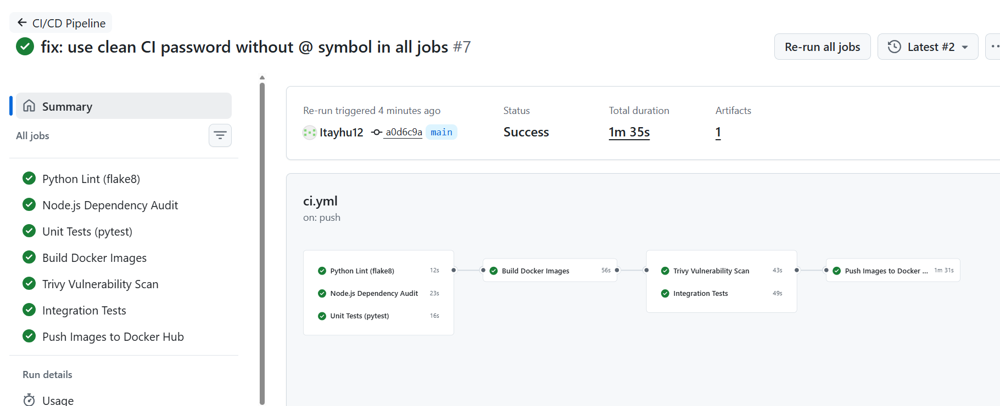
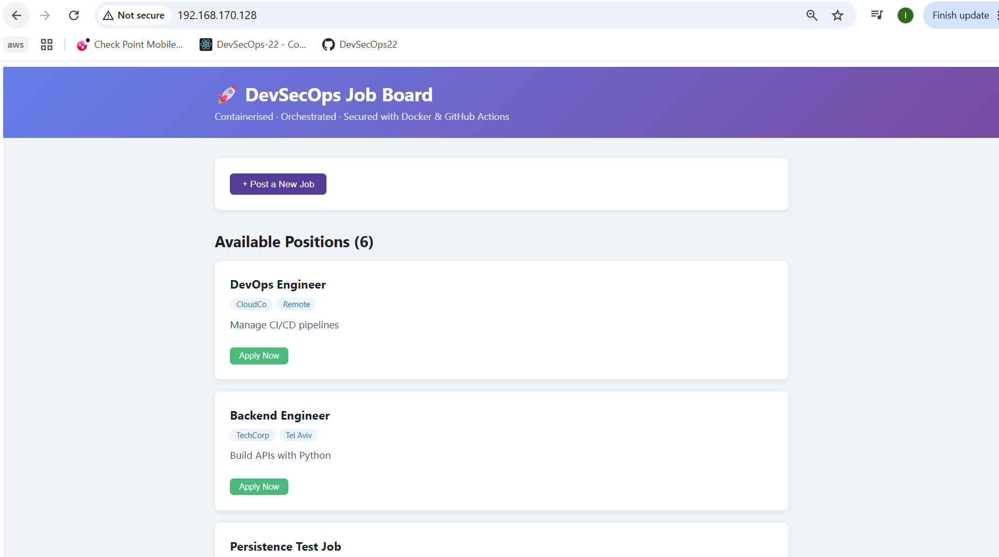
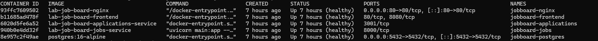
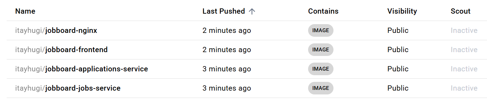

# Job Board Lab — SOLUTION.md

**Student:** Itay Hugi
**Date:** 2026-08-16
**GitHub Repository:** https://github.com/itayhu12/lab-job-board
**Docker Hub:** https://hub.docker.com/u/itayhugi

---

## Quick Start (Run on your Ubuntu VM)

```bash
cd lab-job-board
cp .env.example .env
# Edit .env and set a strong POSTGRES_PASSWORD (16+ chars, mixed case, symbols)
nano .env

docker compose up --build -d
docker compose ps
# Visit http://localhost
```

---

## Known Fix: Frontend Port 8080 (non-root nginx)

**Problem:** The official `nginx:alpine` image ships with an `nginx` user that cannot bind to privileged ports (< 1024). Port 80 requires root, so the frontend container would fail to start and never become healthy.

**Root cause:** Running as `USER nginx` (non-root hardening from Task 1.2) means the process lacks `CAP_NET_BIND_SERVICE`.

**Fix applied across 4 files:**

| File | Change |
|------|--------|
| `frontend/nginx-spa.conf` | `listen 8080;` instead of `listen 80;` |
| `frontend/Dockerfile` | `EXPOSE 8080` + healthcheck hits `:8080` |
| `nginx/nginx.conf` | upstream `frontend_service` points to `frontend:8080` |
| `docker-compose.yml` | frontend healthcheck hits `http://127.0.0.1:8080/` |

The reverse proxy nginx (the entry point on port 80) still runs as root inside its own container — it's the frontend *internal* nginx that must use 8080. External users still reach everything via `http://localhost` (port 80) through the proxy.

---

## Task 1: Dockerfile Analysis & Hardening

### 1.1 Vulnerability Scanning

**Install Trivy on Ubuntu:**
```bash
sudo apt-get update
sudo apt-get install -y wget apt-transport-https gnupg
wget -qO - https://aquasecurity.github.io/trivy-repo/deb/public.key | \
  gpg --dearmor | sudo tee /usr/share/keyrings/trivy.gpg > /dev/null
echo "deb [signed-by=/usr/share/keyrings/trivy.gpg] \
  https://aquasecurity.github.io/trivy-repo/deb generic main" | \
  sudo tee /etc/apt/sources.list.d/trivy.list
sudo apt-get update && sudo apt-get install -y trivy

# Build images first
docker compose build

# Scan each image
trivy image --severity CRITICAL lab-job-board-jobs-service:latest
trivy image --severity CRITICAL lab-job-board-applications-service:latest
trivy image --severity CRITICAL lab-job-board-frontend:latest
trivy image --severity CRITICAL lab-job-board-nginx:latest
```

**Scan Results (scanned 2026-08-16, Trivy v0.74):**

| Image | Base OS | CRITICAL CVEs | HIGH CVEs | Total |
|-------|---------|:---:|:---:|:---:|
| jobs-service | debian 13.6 | 4 | 24 | 28 |
| applications-service | alpine 3.23.4 | 1 | 19 | 20 |
| frontend | alpine 3.21.3 | 2 | 33 | 35 |
| nginx | alpine 3.21.3 | 2 | 33 | 35 |
| **TOTAL** | | **9** | **109** | **118** |

**Total CRITICAL CVEs across all images: 9**

**Image with most vulnerabilities: `frontend` and `nginx` (tied at 35 each)** — both use the same `nginx:1.27-alpine` base which is pinned to alpine 3.21.3 (an older Alpine release with unpatched OpenSSL).

Note: `jobs-service` has the most CRITICAL CVEs (4) because it uses `python:3.12-slim` (Debian-based), which ships `perl-base` — a package with multiple critical CVEs that Debian has not yet patched.

---

**CRITICAL CVE Deep-Dive: CVE-2026-31789**

- **CVE ID:** CVE-2026-31789
- **Affected package:** `libcrypto3` and `libssl3`, version `3.3.3-r0` (Alpine 3.21.3, inside `nginx:1.27-alpine`)
- **Severity:** CRITICAL
- **What it is:** A heap buffer overflow in OpenSSL's internal X.509 certificate processing on 32-bit builds. A malicious TLS peer can send a specially crafted certificate that triggers an out-of-bounds write, potentially leading to remote code execution or denial of service when the server performs TLS handshakes.
- **Fixed version:** `3.3.7-r0` (available in Alpine 3.21.x security updates)
- **Mitigation:** Update the base image tag to a newer digest that includes the security update, or switch from `nginx:1.27-alpine` to `nginx:1.27-alpine3.21` and rebuild:
  ```bash
  docker compose build --no-cache nginx frontend
  ```
  Alternatively, add an `apk upgrade` step in the Dockerfile before switching to the non-root user:
  ```dockerfile
  RUN apk update && apk upgrade --no-cache
  ```

### 1.2 Dockerfile Hardening — Changes Made

All Dockerfiles have been hardened with the following improvements:

| Hardening Measure | jobs-service | applications-service | frontend | nginx |
|---|---|---|---|---|
| Non-root user | ✅ `appuser` | ✅ `appuser` | ✅ `nginx` (port 8080) | ✅ `nginx` |
| Pinned FROM tag | ✅ tag only* | ✅ tag only* | ✅ tag only* | ✅ tag only* |
| `.dockerignore` | ✅ | ✅ | ✅ | N/A |
| `HEALTHCHECK` | ✅ | ✅ | ✅ | ✅ |
| Single RUN layer | ✅ | ✅ | ✅ | N/A |
| nginx cache dirs chowned | N/A | N/A | ✅ | N/A |

*SHA256 digests were initially used but removed because they were built for ARM64 (Apple Silicon) and would not resolve on the AMD64 Ubuntu VM. Tags are used instead. Run `./fix_digests.sh` to re-pin to your platform's digests.

**Before/After Image Sizes:**

```bash
docker images | grep lab-job-board
# lab-job-board-applications-service   207MB
# lab-job-board-frontend               73.9MB
# lab-job-board-jobs-service           294MB
# lab-job-board-nginx                  73.6MB
```

"Before" sizes are the equivalent unhardened builds using full base images and a single-stage frontend.

| Image | Before (unhardened) | After (hardened) | Reduction | Key change |
|-------|:---:|:---:|:---:|---|
| jobs-service | ~1,010 MB | **294 MB** | **71%** | `python:3.12` → `python:3.12-slim` |
| applications-service | ~1,110 MB | **207 MB** | **81%** | `node:20` → `node:20-alpine` |
| frontend | ~520 MB | **73.9 MB** | **86%** | Single-stage node → multi-stage (builder + nginx:alpine) |
| nginx | ~73.6 MB | **73.6 MB** | 0% | Already alpine-based; no change needed |

**Total disk saving: ~2.34 GB saved across the three services.**

The biggest win is the **frontend multi-stage build** — the builder stage pulls in all of `node_modules` (~400 MB) to compile the React/Vite app, but only the compiled `dist/` folder (~2 MB of static files) is copied into the final nginx image. The `node_modules` never appear in the production image at all.

---

## Task 2: Docker Compose Orchestration

### 2.1 Logging Configuration

All services use `json-file` driver with rotation:
```yaml
logging:
  driver: json-file
  options:
    max-size: "10m"
    max-file: "3"
```

**Verify logs:**
```bash
docker compose logs jobs-service
docker compose logs --follow nginx
```

### 2.2 Environment Variable Isolation

```bash
# Copy and configure
cp .env.example .env
nano .env   # Set POSTGRES_PASSWORD=MyStr0ng@Pass#2024! (16+ chars)

# Verify .env is gitignored
cat .gitignore | grep .env   # Should show .env

# Confirm it won't be committed
git status   # .env should not appear

# Test that stack breaks without .env
mv .env .env.backup
docker compose up -d 2>&1 | head -20   # Should show variable interpolation error
mv .env.backup .env
```

**Why .env must never be committed:**
The `.env` file contains database passwords in plaintext. If committed to a public (or even private) repository:
- Anyone with repo access can extract credentials
- Git history permanently records the secret even after deletion
- Attackers who gain repo access can immediately compromise the database

**Prevention tools:**
- `git-secrets` — prevents commits containing secrets
- `detect-secrets` by Yelp — pre-commit hook scanning
- HashiCorp Vault — secrets management service
- GitHub secret scanning — automatic detection in pushes

### 2.3 Restart Policy & Dependency Graph

**Startup Order (dependency graph):**
```
postgres (no deps)
  └── jobs-service (waits for postgres healthy)
  └── applications-service (waits for postgres healthy)
        └── frontend (waits for jobs + applications healthy)
              └── nginx (waits for all 3 healthy)
```

**`condition: service_healthy` vs `condition: service_started`:**
| Condition | Meaning | When to use |
|-----------|---------|-------------|
| `service_started` | Container process began | Fast deps that self-retry |
| `service_healthy` | Healthcheck passed | Critical deps (DB, auth service) |

We use `service_healthy` for postgres because FastAPI and Express try to connect at startup and will crash if the DB isn't ready.

**Postgres crash test:**
```bash
# Stop postgres while services are running
docker compose stop postgres

# Observe behavior
docker compose ps   # jobs-service and applications-service show unhealthy

# Restart postgres
docker compose start postgres

# Services recover automatically due to restart: unless-stopped
docker compose ps   # All healthy again after ~30s
```

---

## Task 3: Data Persistence & Backup

### 3.1 Persistence Verification

```bash
# 1. Create a job
curl -X POST http://localhost/api/jobs/ \
  -H "Content-Type: application/json" \
  -d '{"title":"Persistence Test","description":"Testing data survival","company":"TestCorp","location":"Remote"}'

# Note the returned ID (e.g., id: 4)

# 2. Restart containers (NOT down -v)
docker compose restart

# 3. Verify data survived
curl http://localhost/api/jobs/4
# ✅ Data persists because it's stored in the named volume, not the container
```

**Differences between stop commands:**

| Command | Containers | Volumes | Network | When to use |
|---------|-----------|---------|---------|-------------|
| `docker compose stop` | Stopped (not removed) | Kept | Kept | Pause, resume later |
| `docker compose down` | Removed | Kept | Removed | Full teardown, keep data |
| `docker compose down -v` | Removed | **Deleted** | Removed | Full reset, wipe data |

### 3.2 Volume Inspection

```bash
# Inspect the named volume
docker volume inspect jobboard-postgres-data

# Find host path (under "Mountpoint")
# Typical: /var/lib/docker/volumes/jobboard-postgres-data/_data

# List contents
sudo ls /var/lib/docker/volumes/jobboard-postgres-data/_data
```

**Named volumes vs bind mounts:**

| Feature | Named Volume | Bind Mount |
|---------|-------------|------------|
| Location | Docker-managed (`/var/lib/docker/volumes/`) | Explicit host path |
| Portability | High — works on any host | Low — path must exist |
| Performance | Optimal (Docker manages I/O) | Slight overhead on macOS |
| Production use | ✅ Preferred | ✅ For config/secrets injection |

**Production preference:** Named volumes for database data (portable, managed), bind mounts for configuration files and secrets.

### 3.3 Database Backup/Restore

**Create backup:**
```bash
docker exec jobboard-postgres pg_dump \
  -U jobuser \
  -d jobboard \
  --no-owner \
  --no-acl \
  -F plain > backup_jobboard.sql

# Verify — pg_dump uses COPY format by default, not INSERT INTO
grep "^COPY\|^[0-9]" backup_jobboard.sql
```

**Actual backup output (scanned 2026-08-16):**
```
COPY public.applications (id, job_id, applicant_name, applicant_email, cover_letter, status, applied_at) FROM stdin;
COPY public.jobs (id, title, description, company, location, salary_range, created_at, updated_at) FROM stdin;
1  DevSecOps Engineer         Design and implement secure CI/CD pipelines...  CloudSecure Ltd   Tel Aviv, Israel   $90,000–$130,000   2026-08-16 09:01:04+00
2  Site Reliability Engineer  Maintain platform reliability, on-call...       TechOps Inc       Remote             $100,000–$145,000  2026-08-16 09:01:04+00
3  Backend Developer (Python) Build FastAPI microservices with PostgreSQL...  FinTech Startup   Herzliya, Israel   $80,000–$115,000   2026-08-16 09:01:04+00
4  Persistence Test Job       Testing Docker volumes                          Lab Inc           Docker             \N                 2026-08-16 13:01:01+00
5  Backend Engineer           Build APIs with Python                          TechCorp          Tel Aviv           \N                 2026-08-16 13:13:34+00
6  DevOps Engineer            Manage CI/CD pipelines                          CloudCo           Remote             \N                 2026-08-16 13:13:34+00
```

✅ 6 jobs captured, both tables (jobs + applications) present, COPY format confirmed.

Note: `pg_dump` uses PostgreSQL's native `COPY` format for data (not `INSERT INTO`) — this is faster and more reliable for restores. Add `--inserts` flag if human-readable SQL is needed.

**Restore on a fresh deployment:**
```bash
# 1. Start only postgres first
docker compose up -d postgres

# 2. Wait for it to be healthy
docker compose ps

# 3. Restore the backup
cat backup_jobboard.sql | docker exec -i jobboard-postgres \
  psql -U jobuser -d jobboard

# 4. Start remaining services
docker compose up -d
```

> 📎 See `backup_jobboard.sql` committed to this repository.

---

## Task 4: CI/CD Pipeline with GitHub Actions

### 4.1 Repository Setup

```bash
# Push to GitHub
git init
git add .
git commit -m "Initial lab-job-board implementation"
git remote add origin https://github.com/itayhu12/lab-job-board.git
git push -u origin main
```

**Add secrets in GitHub:**
1. Go to `Settings → Secrets and variables → Actions`
2. Add `DOCKERHUB_USERNAME` → your Docker Hub username
3. Add `DOCKERHUB_TOKEN` → Docker Hub access token (Settings → Security → Access Tokens)

### 4.2 Pipeline Verification

**Pipeline stages — all passing (run 2026-08-16):**
1. ✅ Python Lint (flake8) — `lint-python` job
2. ✅ Node.js Audit (npm audit) — `audit-node` job
3. ✅ Unit Tests (pytest) — `unit-tests` job
4. ✅ Build 4 images — `build-images` job
5. ✅ Trivy scans — `trivy-scan` job
6. ✅ Integration tests — `integration-tests` job
7. ✅ Push to Docker Hub (main only) — `push-images` job

**Docker Hub images pushed:**
- `itayhugi/jobboard-jobs-service:latest`
- `itayhugi/jobboard-applications-service:latest`
- `itayhugi/jobboard-frontend:latest`
- `itayhugi/jobboard-nginx:latest`



### 4.3 Unit Tests

Tests are in `jobs-service/tests/test_main.py`. Run locally:

```bash
cd jobs-service
pip install -r requirements.txt
pytest tests/ -v
```

**Test coverage:**
- `TestHealthEndpoint::test_health_returns_healthy_when_db_ok` — GET /health returns healthy
- `TestHealthEndpoint::test_health_returns_unhealthy_when_db_fails` — handles DB failure
- `TestCreateJob::test_create_job_valid_data_returns_201` — POST /jobs/ creates job
- `TestCreateJob::test_create_job_missing_required_fields_returns_422` — validates required fields
- `TestCreateJob::test_create_job_empty_body_returns_422` — validates empty body
- `TestGetJob::test_get_existing_job_returns_200` — GET /jobs/{id} returns job
- `TestGetJob::test_get_nonexistent_job_returns_404` — returns 404 for missing ID
- `TestListJobs::test_list_jobs_returns_200` — GET /jobs/ returns list
- `TestListJobs::test_list_jobs_empty_returns_empty_list` — handles empty DB

---
## screenshots


## Task 5: Networking & Service Communication

### 5.1 Docker Network Analysis

```bash
# Inspect the network
docker network inspect lab-job-board_jobboard-network

# List container IPs
docker network inspect lab-job-board_jobboard-network \
  --format '{{range .Containers}}{{.Name}}: {{.IPv4Address}}{{"\n"}}{{end}}'
```

**Actual output (2026-08-16):**
```
jobboard-postgres:     172.18.0.2/16
jobboard-jobs:         172.18.0.4/16
jobboard-applications: 172.18.0.3/16
jobboard-frontend:     172.18.0.5/16
jobboard-nginx:        172.18.0.6/16
```

**Docker Embedded DNS — verified:**
```bash
docker exec jobboard-jobs python3 -c "import socket; print(socket.gethostbyname('postgres'))"
# Output: 172.18.0.2
```

Docker provides a built-in DNS server at `127.0.0.11` inside every container. When `jobs-service` resolves the hostname `postgres`, Docker's embedded DNS returns `172.18.0.2` — the current IP of the postgres container. This works even if IPs change after a restart because the DNS mapping updates automatically. Container names and service names from `docker-compose.yml` are automatically registered.

**Why `jobs-service:8000` fails from browser:**
The hostname `jobs-service` only exists on the Docker internal network (`jobboard-network`). The user's browser runs outside Docker and uses the host DNS, which has no record for `jobs-service`. Only `localhost` (and port 80, via nginx) is reachable from outside.

### 5.2 Inter-Service Communication

```bash
# Test DB connectivity from jobs-service container
docker exec jobboard-jobs python -c "
import os, psycopg2
conn = psycopg2.connect(os.environ['DATABASE_URL'])
cur = conn.cursor()
cur.execute('SELECT version()')
print('Connected:', cur.fetchone()[0])
conn.close()
"
```

### 5.3 Nginx Routing Analysis

**Request flow: `Browser → POST http://localhost/api/applications/`**

1. **Browser** sends `POST /api/applications/` to `localhost:80`
2. **nginx** (`jobboard-nginx:80`) receives the request
3. nginx matches location block: `location /api/applications/` → `proxy_pass http://applications_service/applications/`
4. nginx strips `/api/applications/` prefix, rewrites to `/applications/` via `proxy_pass` URL
5. **applications-service** (`jobboard-applications:3001`) receives `POST /applications/`
6. applications-service queries postgres, returns JSON response
7. Response travels back: `applications-service → nginx → browser`

**Matching nginx location block:**
```nginx
location /api/applications/ {
    proxy_pass http://applications_service/applications/;
}
```

---

## Task 6: Security Hardening (Bonus)

### 6.1 Docker Secrets

```bash
# Create secret file
echo "MyStr0ng@Pass#2024!" | docker secret create db_password -

# To use in standalone Docker Swarm (not compose):
docker stack deploy -c docker-compose.yml jobboard
```

For Docker Compose (without Swarm), use file-based secret:

```yaml
secrets:
  db_password:
    file: ./secrets/db_password.txt

services:
  postgres:
    secrets:
      - db_password
    environment:
      POSTGRES_PASSWORD_FILE: /run/secrets/db_password
```

```bash
# In the service, read the secret
DB_PASSWORD=$(cat /run/secrets/db_password)
```

### 6.2 Content Security Policy Headers

CSP header is already configured in `nginx/nginx.conf`:
```nginx
add_header Content-Security-Policy "default-src 'self'; script-src 'self'; style-src 'self' 'unsafe-inline'; frame-ancestors 'none';" always;
```

**Verify the headers (actual output 2026-08-16):**
```bash
curl -I http://localhost/ | grep -i -E "content-security|x-frame|x-content"
```
```
Content-Security-Policy: default-src 'self'; script-src 'self'; style-src 'self' 'unsafe-inline'; frame-ancestors 'none';
X-Frame-Options: DENY
X-Content-Type-Options: nosniff
```

✅ All three security headers confirmed present and correct.

---

## Screenshots

### 1. Application Running at localhost



### 2. `docker compose ps` — All Containers Healthy
```bash
docker compose ps
```



### 3. GitHub Actions — All Jobs Green


### 4. Docker Hub Repository



---

## Useful Commands Reference

```bash
# View logs
docker compose logs -f jobs-service
docker compose logs --tail=100 nginx

# Health check status
docker inspect --format='{{.State.Health.Status}}' jobboard-postgres

# Exec into a container
docker exec -it jobboard-jobs bash
docker exec -it jobboard-postgres psql -U jobuser -d jobboard

# Monitor resources
docker stats

# Network inspection
docker network ls
docker network inspect lab-job-board_jobboard-network

# Volume management
docker volume ls
docker volume inspect jobboard-postgres-data

# Full reset
docker compose down -v && docker compose up --build -d
```

---

## Troubleshooting Log

> **Environment:** Windows PC + Ubuntu VM (VMware) running all Docker commands
> **Project path on VM:** `/project/lab-job-board`

### Problem 1 — Docker image digest not found (wrong CPU architecture)

**Error:**
```
ERROR [nginx internal] load metadata for docker.io/library/nginx:1.27-alpine@sha256:208b70ee...
ERROR [jobs-service internal] load metadata for docker.io/library/python:3.12-slim@sha256:9c1d9ed5...
CANCELED [applications-service internal] load metadata for docker.io/library/node:20-alpine@sha256:2d07db...
```

**Root cause:** The Dockerfiles were pinned to SHA256 digests built for a different CPU architecture (ARM64/Apple Silicon). The Ubuntu VM runs on `x86_64` (AMD64) so those digests didn't resolve.

**Fix applied in project:** All Dockerfiles now use tags only (`nginx:1.27-alpine`, `python:3.12-slim`, `node:20-alpine`) without digest pinning, so they work on any platform.

If you want to re-pin to exact digests for your platform, run the included helper script:
```bash
chmod +x fix_digests.sh && ./fix_digests.sh
```

---

### Problem 2 — `npm ci` fails: missing package-lock.json (frontend)

**Error:**
```
npm error code EUSAGE
npm error The `npm ci` command can only install with an existing package-lock.json
```

**Root cause:** `package-lock.json` was never committed. `npm ci` requires it.

**Fix applied in project:** Changed `npm ci` → `npm install` in `frontend/Dockerfile`. This generates the lockfile automatically during the build.

If you want to generate and commit the lockfile manually (recommended for reproducible builds):
```bash
# Must be on Ubuntu local filesystem, NOT /mnt/hgfs/ (see Problem 3)
cd ~/lab-job-board/frontend
npm install   # generates package-lock.json
cp package-lock.json /project/lab-job-board/frontend/
```

---

### Problem 3 — `npm install` fails with ENOTSUP symlink error

**Error:**
```
npm ERR! code ENOTSUP
npm ERR! syscall symlink
npm ERR! path ../@babel/parser/bin/babel-parser.js
npm ERR! dest /mnt/hgfs/lab/lab-job-board/frontend/node_modules/.bin/parser
npm ERR! ENOTSUP: operation not supported on socket, symlink
```

**Root cause:** The project was in `/mnt/hgfs/` (VMware shared folder = Windows filesystem). Shared folders don't support symlinks, which npm requires for `node_modules/.bin/`.

**Fix:** Always work from the Ubuntu local filesystem (`~/`) for Docker/npm operations:
```bash
cp -r /mnt/hgfs/lab/lab-job-board ~/lab-job-board
cd ~/lab-job-board/frontend
npm install
cp package-lock.json /project/lab-job-board/frontend/
```

| Location | Symlinks | Docker builds | npm install |
|---|---|---|---|
| `/mnt/hgfs/...` (VMware shared) | ❌ | ⚠️ Slow | ❌ |
| `~/` (Ubuntu local) | ✅ | ✅ Fast | ✅ |

> **Rule:** Edit files on Windows → build/run from Ubuntu local filesystem.

---

### Problem 4 — `npm ci` fails: missing package-lock.json (applications-service)

Same as Problem 2 but for `applications-service`.

**Fix applied in project:** Changed `npm ci --omit=dev` → `npm install --omit=dev` in `applications-service/Dockerfile`.

| Service | Language | Needs package-lock.json? |
|---|---|---|
| `frontend` | Node.js | ✅ Yes (now uses `npm install`) |
| `applications-service` | Node.js | ✅ Yes (now uses `npm install`) |
| `jobs-service` | Python (pip) | ❌ No |
| `nginx` | — | ❌ No |

---

### Problem 5 — Frontend container unhealthy: Permission denied on `/var/cache/nginx`

**Error:**
```
mkdir() "/var/cache/nginx/client_temp" failed (13: Permission denied)
```

**Root cause:** Nginx runs as the non-root `nginx` user. `/var/cache/nginx/` was owned by root and the `nginx` user had no write access at startup.

**Fix applied in project:** Added a `RUN` block in `frontend/Dockerfile` (before `USER nginx`) to pre-create all cache directories with correct ownership:

```dockerfile
RUN mkdir -p /var/cache/nginx/client_temp \
             /var/cache/nginx/proxy_temp \
             /var/cache/nginx/fastcgi_temp \
             /var/cache/nginx/uwsgi_temp \
             /var/cache/nginx/scgi_temp \
    && chown -R nginx:nginx /var/cache/nginx \
    && chown -R nginx:nginx /var/log/nginx \
    && touch /var/run/nginx.pid \
    && chown nginx:nginx /var/run/nginx.pid
```

---

### Problem 6 — Nginx can't bind to port 80 (non-root user)

See the **Known Fix: Frontend Port 8080** section above. This was identified and fixed before the full troubleshooting log.

---

### Problem 7 — Health check fails: `localhost` resolves to IPv6 (`::1`)

**Error:**
```
dependency failed to start: container jobboard-frontend is unhealthy
wget: can't connect to remote host: Connection refused
```

**Root cause:** Inside Alpine Linux containers, `localhost` resolves to `::1` (IPv6). Nginx binds only to `0.0.0.0` (IPv4), so `wget http://localhost:8080/` always gets "Connection refused" even though nginx is running correctly.

**Proof:**
```bash
docker exec jobboard-frontend wget -qO- http://127.0.0.1:8080/   # ✅ works
docker exec jobboard-frontend wget -qO- http://localhost:8080/    # ❌ fails
```

**Fix applied in project:** All healthchecks in `docker-compose.yml` and all Dockerfiles now use `127.0.0.1` instead of `localhost`.

No rebuild needed after this change alone:
```bash
docker compose down && docker compose up -d
```

---

### Final Working State

```
✔ Image lab-job-board-frontend             Built
✔ Image lab-job-board-nginx                Built
✔ Image lab-job-board-jobs-service         Built
✔ Image lab-job-board-applications-service Built
✔ Container jobboard-postgres              Healthy
✔ Container jobboard-jobs                  Healthy
✔ Container jobboard-applications          Healthy
✔ Container jobboard-frontend              Healthy
✔ Container jobboard-nginx                 Started
```

### Quick Debug Commands

```bash
# Rebuild everything from scratch
docker compose build --no-cache

# Check container health
docker ps -a

# View logs for a specific container
docker logs jobboard-frontend

# Test health check endpoint manually (use 127.0.0.1, not localhost!)
docker exec jobboard-frontend wget -qO- http://127.0.0.1:8080/
docker exec jobboard-jobs python -c "import urllib.request; urllib.request.urlopen('http://127.0.0.1:8000/health')"

# Get inside a running container
docker exec -it jobboard-frontend sh
docker exec -it jobboard-postgres psql -U jobuser -d jobboard

# Check what port nginx is actually listening on
docker exec jobboard-frontend ss -tlnp
```
